# Interacting With The Connector Through web user interface

# Overview

In your browser proceed to `http://localhost:8083/` and you will be reidrected to `http://localhost:8083/dashboard` and should see the following:

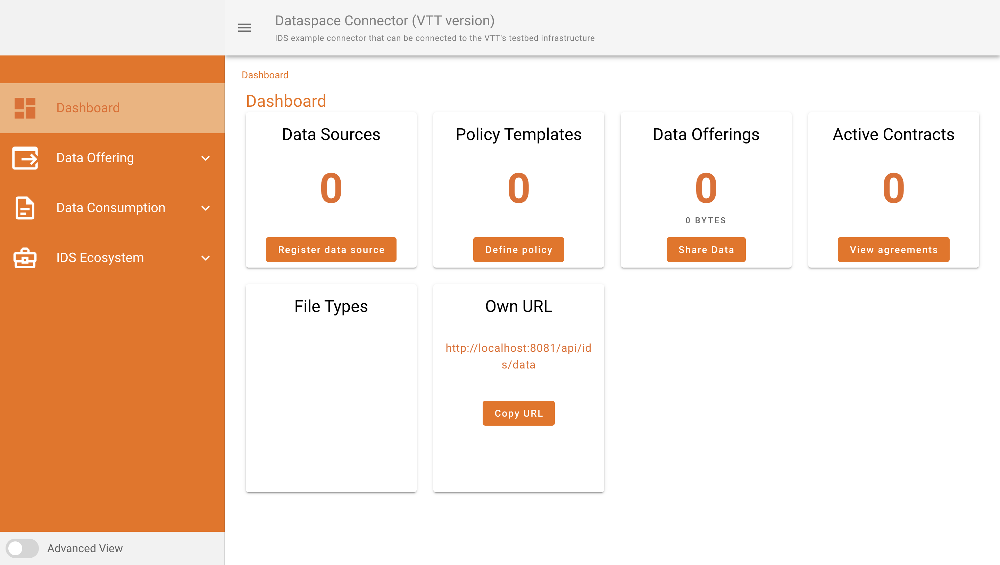

This provides an overview of your connector.

## Creating a data offering

A data offering is an asset that you register with your connector and can provide to other connectors that agree to use the offering under the conditions you specifiy.

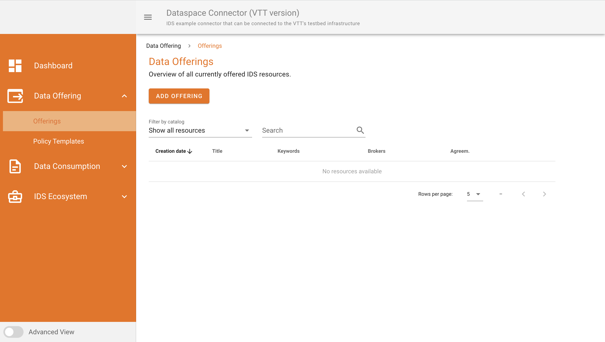

This view will show you current offering that are registered to the connector and will allow you to add new offerings by clicking "ADD OFFERING". 

Clicking "ADD OFFERING" will take you to the following page:

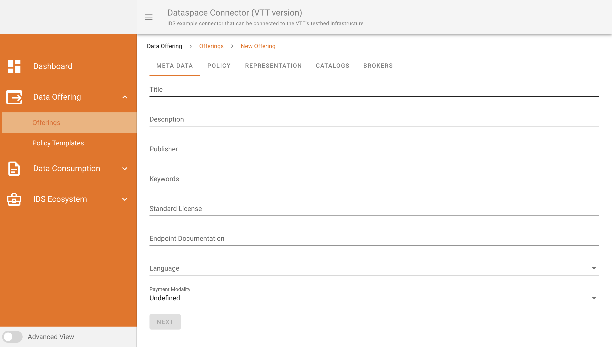

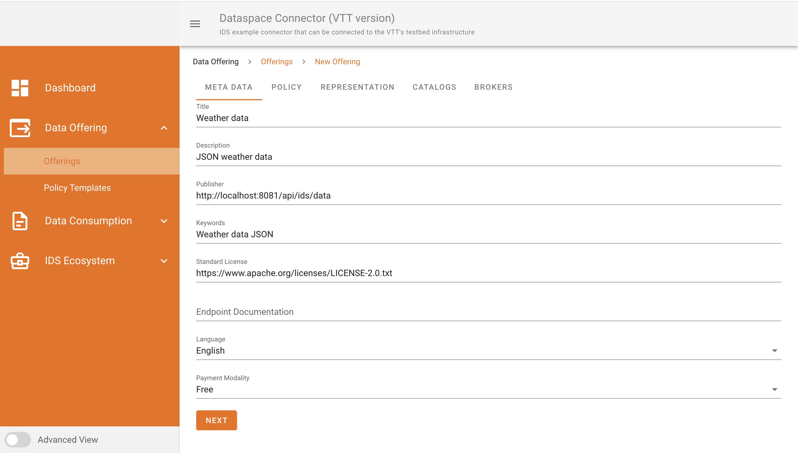

When all the fields are completed move on to the next tab. The Policy tab sets the criteria the consumer will have to agree to in order to use the offering.

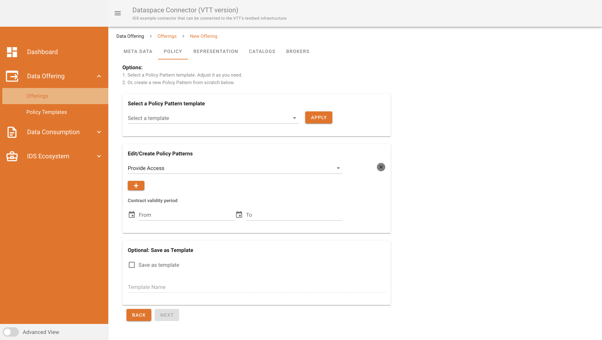

You can make a policy template or create a new one for each offtering.

Next we will proceed to the representations tab which allows you to upload a file (.json, .csv) or upload and external data source (REST API, database connection, remote document).

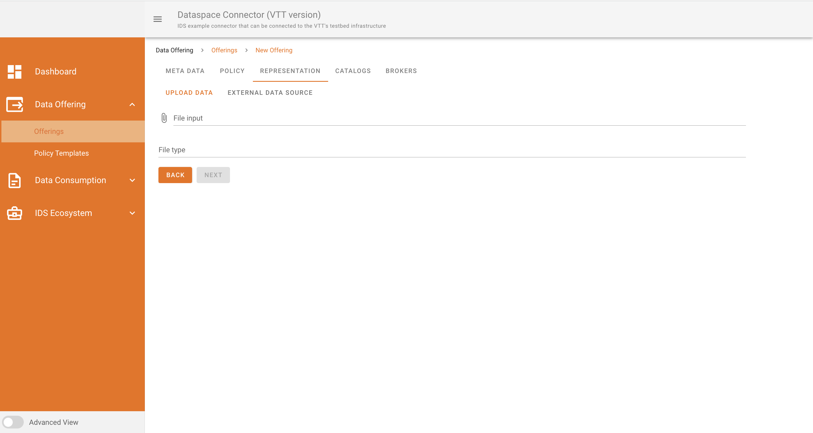

The catalogue tab allows you to create a catalogue (grouping) of similar offerings.

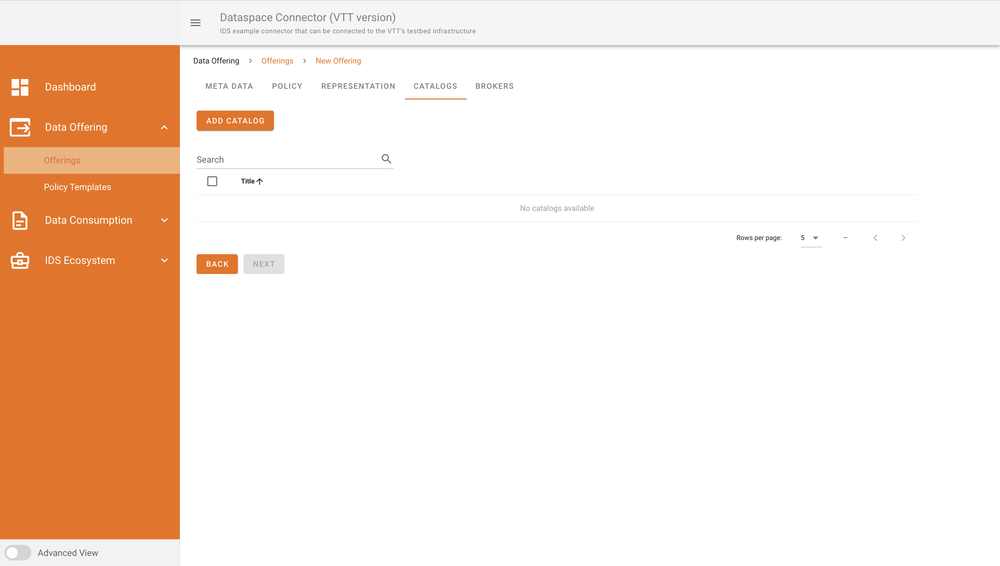

Finally you can then register your offering, policy and catalog to a broker that has previously been configured to the connector.

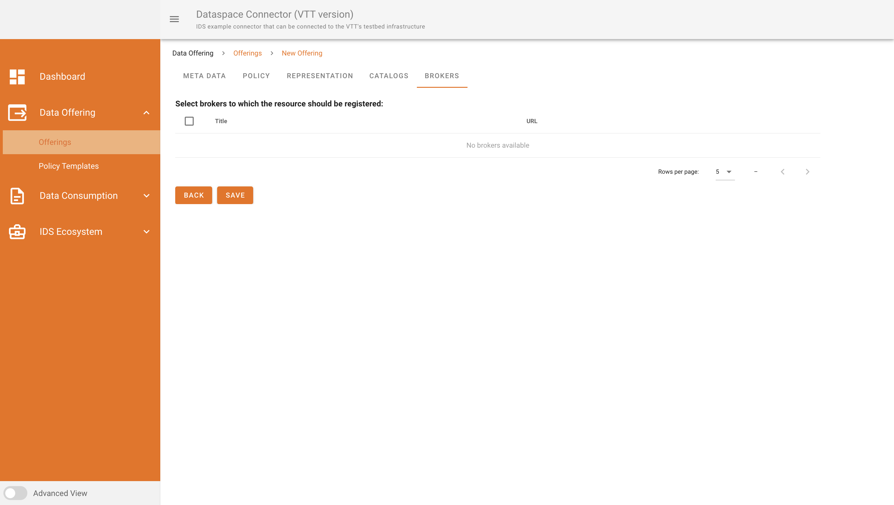

By clicking save you are making the offering available.

## Consuming a data offering

To consume a data offering you will need to have the connector URL `http://localhost:8081/api/ids/data`. Once you have the connector URL proceed to the Data consumption tab Requests and from here you can see all offering which you have already agreeded to consume

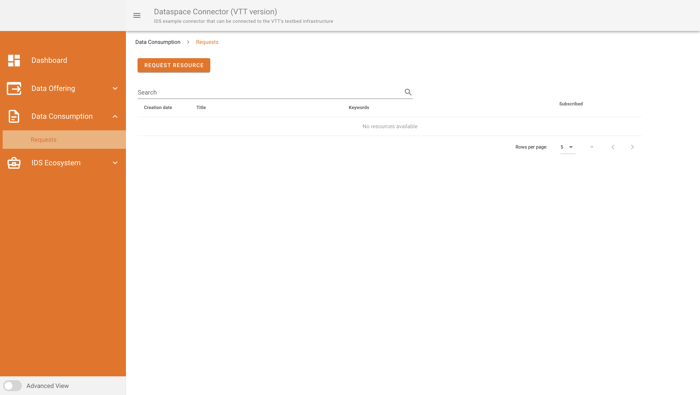

Start by clicking on Request resource and in the new tab provide the connector URL that you want to consume data from 

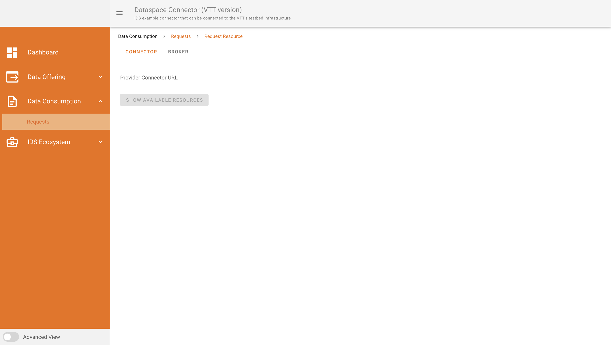

Show available resources will then fetch all resources from the connector where you can then view them in more detail by selecting the show representations or show meta data icons at the end of each row.

Selecting show representations will provide a URL which when clicked will show an artifact and at the end of the artifact row will allow you to agree or disagree with the contract (policy) for the offering. After agreeing you will be provided with a download URL which can be used to download the offering. 

It is also possible to add this offering to a previously configured route.

## Adding a broker to the connector

To add a broker to the connector select IDS eco system and select broker

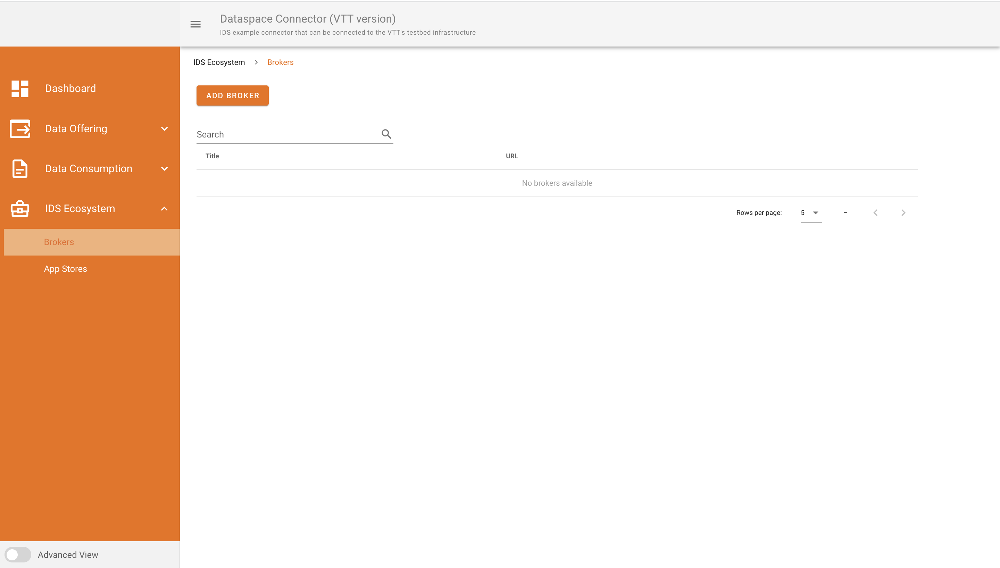

From this page you can see all configured brokers and add new ones by clicking add broker, to do this you will need a broker URL `http:/localhost:8080/infrastructure` once you have provided the broker URL and a title you can then save and register the broker with your connector